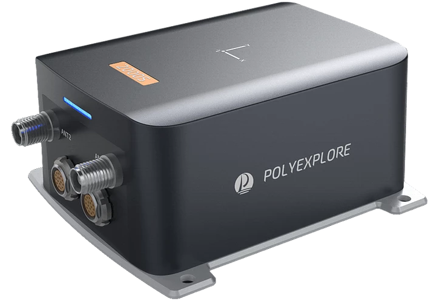

<!-- PROJECT LOGO -->
<br />


  <h3 align="center">ROS2 Driver</h3>

  <p align="center">
    PolyExplore, Inc.
    <br />
    <a href="https://www.polyexplore.com/"><strong>Visit Our Website</strong></a>
  </p>
  <p align="center">
  <a href="https://github.com/othneildrew/Best-README-Template">
    
  </a>
</p>


<!-- TABLE OF CONTENTS -->
<details open="open">
  <summary>Table of Contents</summary>
  <ol>
    <li>
      <a href="#installation">Installation</a>
      <!-- <ul>
        <li><a href="#built-with">Built With</a></li>
      </ul> -->
    </li>
    <li><a href="#ethernet-output">Ethernet Output</a></li>
    <li><a href="#local-map-origin">Local Map Origin</a></li>
    <li><a href="#static-heading Event">Static Heading Event</a></li>
    <li><a href="#static-geopose Event">Static Geo-Pose Event</a></li>
    <li><a href="#imu-data">IMU Data</a></li>
    <li><a href="#geoid-height">Geoid Height</a></li>
    <li><a href="#contact">Contact</a></li>
  </ol>
</details>

<p align="center">
    
</p>

<!-- ABOUT THE PROJECT -->
## Installation
1. Install ROS2 following this [link](https://index.ros.org/doc/ros2/Installation/#installationguide)  
Please make sure development tools are all installed, check [this](https://index.ros.org/doc/ros2/Installation/Foxy/Linux-Development-Setup/#id5)
2. Clone the repo
   ```sh
   git clone https://github.com/polyexplore/ROS2_Driver.git
   ```
2. Copy our polyx_node folder to your source directory, for example ~/colcon_ws/src/
   ```sh
   mv ROS2_driver/polyx_node ~/colcon_ws/src/
   ```
3. Build
   ```sh
   cd ~/colcon_ws/
   colcon build --symlink-install
   ```
4. Once compiles successfully, please source your workspace again
   ```sh
   source install/setup.bash
   ```
We have successfully built our driver on Dashing and Foxy-FitzRoy


<!-- GETTING STARTED -->

## Ethernet Output
1. Connect our device to the eithernet port, figure out the device's static ip, for example 10.1.10.194
2. Open the param/polyx_talker_params.yaml, you will see the following parameterss
    ```yaml
    /polyx_ns:
      polyx_node_talker:
        ros__parameters:
          use_sim_time: False
          eth_enable: True
          eth_server: 192.168.130.97 #"10.1.10.194"
          eth_port: "8888"
          polyx_wheelspeed:   "/polyx_events/polyx_WheelSpeed"
          polyx_staticheading: "/polyx_events/polyx_StaticHeading"
          polyx_staticgeopose: "/polyx_events/polyx_StaticGeoPose"
          polyx_output: 0xFFFFFFFF
    ```
  * eth_server to the static ip you found out in the last step
  * eth_enable turns on/off ethernet port
  * eth_port is fixed to "8888"
  * polyx_wheelspeed is the wheel speed event 
  * polyx_staticgeopose is the static geopose event
  * polyx_staticheading is the static heading event
  * polyx_output is the bitmask for output messages, by default everything is turned on
3. launch the talker
    ```sh
    ros2 launch polyx_node polyx_talker_launch.py 
    ``` 
4. check the topics published
    ```sh
    ros2 topic list
    ```
    you should be able to see some topics, for example like below
    ```sh
    /polyx_ns/polyx_Kalman
    /polyx_ns/polyx_compactNav
    /polyx_ns/polyx_correctedIMU
    ```
## Local Map Origin
By default the ROS2 driver uses the first navigation solution as the origin. To set a specific position as the origin of your local map, please use the following function defined in polyx_convert.cpp:
  ```cpp
  void SetCustomOrigin(
    double               latitude,   // radian
    double               longitude,  // radian
    double               altitude,   // meters
    struct origin_type&  org);
   ```
In polyx_node_talker.cpp, look for the follwoing part and replace SetOrigin() with SetCustomOrigin().
  ```cpp
  if (!is_origin_set) {
    SetOrigin(msg, myorigin);
    is_origin_set = true;
  }
  ```
After any modification, please compile again using the following commands
```sh
cd ~/colcon_ws && colcon build --symlink-install
```

## Static Geo-Pose Event

Sometimes, GNSS signals are not available. In this case, the static geo-pose event can be used to 
initialize or aid the system. Especially, it is possible to hold the position and heading at a specific 
point. To generate this event, open a new terminal and follow the steps below: 

```sh
ros2 launch polyx_node polyx_static_geopose_launch.py 
```
a sample param file can be found at param/polyx_static_geopose_params.yaml
```yaml
/polyx_events: # this ns has to be consistent with launch.py ns(which overwrite node ns)
  event_gen: # this name has to be consistent with node name, not type!
    ros__parameters:
      use_sim_time: False
      latitude: 37.405109067        #[deg]
      longitude: -121.918100758     #[deg]
      ellipsoidal_height: -10.136   #[m]
      roll: 0         #[0.01 deg]
      pitch: 0        #[0.01 deg]
      heading: 2500   #[0.01 deg]
      position_rms: 1  #[cm]
      zupt_rms: 10            #[mm]
      heading_rms: 10        #[0.1 deg]
      flags: 0
```

where latitude, longitude, ellipsoidal_height, position_rms, zupt_rms, heading, 
heading_rms, roll, pitch are optional parameters and the units are in degrees, degrees, 
m, m, m/s, degrees, degrees, seconds, degrees, degrees, respectively. 

Valid range of optional parameters: 
latitude: -90 ~ 90 deg; longitude: -180 ~ 180 deg; 
position_rms: 0.00 ~ 655.35 m; zupt_rms: 0.000 ~ 65.535 m/s; 
heading: -180.00 ~ 180.00 deg; heading_rms: 0.0 ~ 25.5 deg; 
roll: -180.00 ~ 180.00 deg; pitch: -90.00 ~ 90.00 deg; 
To see more use the following command:
```sh
ros2 msg show polyx_node/msg/StaticGeoPoseEvent
```
You are also welcome to take a look at the source code

## Static Heading Event

It may be difficult to initialize the heading by the dual-GNSS antenna system if the system is in a location where the signal is degraded. In this case, the system can be initialized using the static heading event. To generate this event, open a new terminal and follow the steps below:
  ```sh
  ros2 launch polyx_node polyx_static_heading_launch.py
  ```
An example param file can be found at param/polyx_static_heading_params.yaml, like below
  ```yaml
  /polyx_events:
    polyx_node_heading:
      ros__parameters:
        use_sim_time: False
        heading: -11600   # unit [0.01 deg]
        zupt_rms: 10      # unit [mm/s]
        heading_rms: 100  # unit [0.1 deg]
        duration: 1.0     # unit [sec]
  ```
where duration is the time interval during which we want to generate the event message. 
Please be very careful with the units, we left comments in the yaml param file. Also you can check the msg type with the following command
```sh
ros2 msg show polyx_node/msg/StaticHeadingEvent
```
then you should see something like this
```sh
std_msgs/Header header

# unit: 0.01 deg
int16 heading

# unit: mm/s
uint16 zupt_rms

# unit: 0.1 deg
uint8 heading_rms
```


## IMU Data

The ROS driver can output both the scaled raw IMU data and the corrected IMU data if the user configured the system to output these messages. Note that the corrected IMU data are available only after the initialization of the inertial navigator. This message contains IMU data corrected for the sensor biases estimated by the fusion algorithm.

## Geoid Height
The Geoid message contains the height of the Geoid above the ellipsoid. Thus the height above Geoid, treated normally as the height of mean sea level (MSL), can be computed as follows:
<p align="center">
Height above MSL = Height above ellipsoid - Geoid height.
</p>

## Contact
Support - [@Support](https://www.polyexplore.com/) - support@polyexplore.com

**Thank you!**
